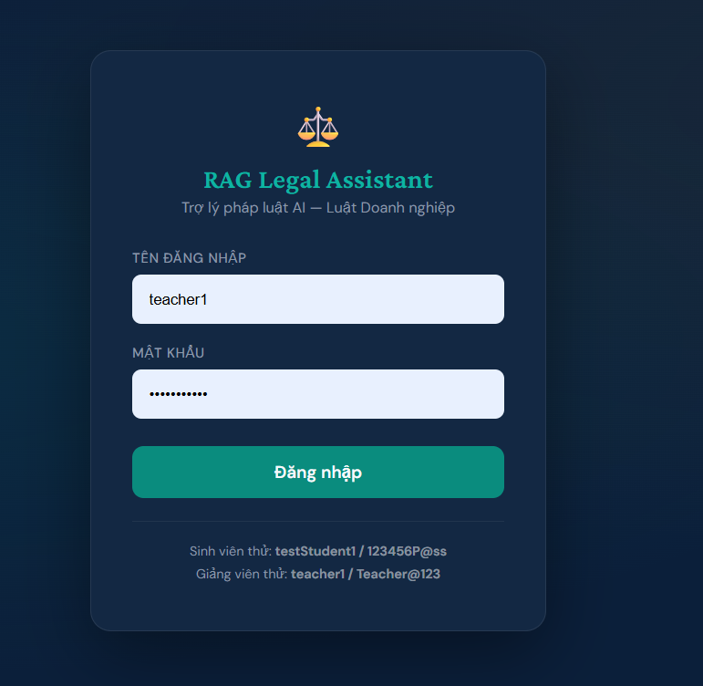
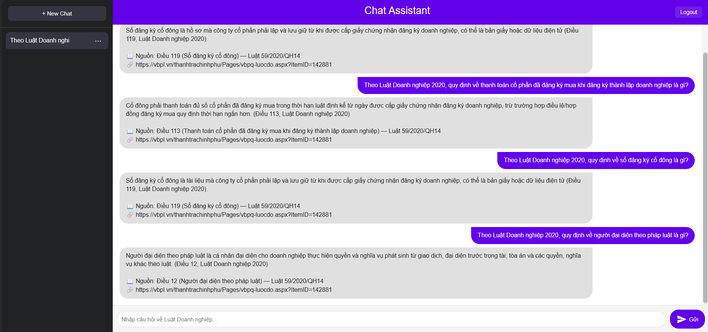
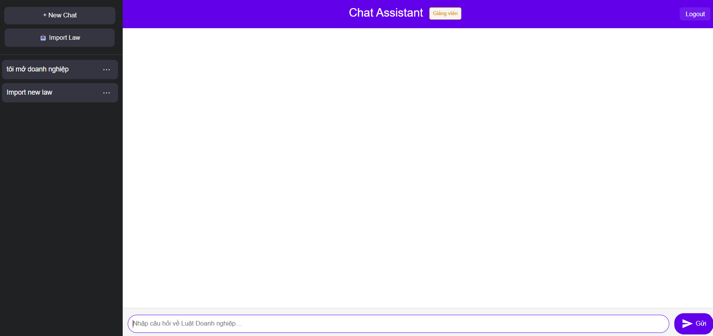
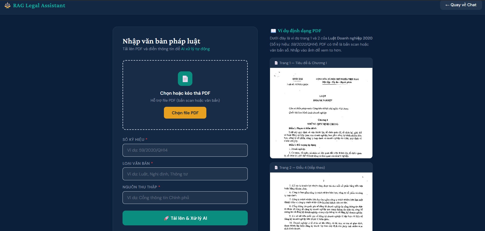
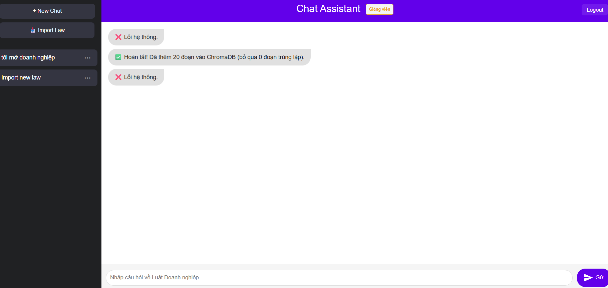

# Hướng Dẫn Demo — RAG Legal Assistant

> Hệ thống trợ lý pháp lý thông minh sử dụng kỹ thuật **RAG (Retrieval-Augmented Generation)**, hỗ trợ tra cứu văn bản luật bằng ngôn ngữ tự nhiên.

---

## Mục Lục

1. [Tổng Quan Hệ Thống](#1-tổng-quan-hệ-thống)
2. [Yêu Cầu & Cài Đặt](#2-yêu-cầu--cài-đặt)
3. [Khởi Động Ứng Dụng](#3-khởi-động-ứng-dụng)
4. [Vai Trò & Tài Khoản](#4-vai-trò--tài-khoản)
5. [Demo Hỏi Đáp Pháp Lý — Vai Trò Học Sinh](#5-demo-hỏi-đáp-pháp-lý--vai-trò-học-sinh)
6. [Demo Nhập Văn Bản Luật (PDF / DOCX) — Vai Trò Giáo Viên](#6-demo-nhập-văn-bản-luật-pdf--docx--vai-trò-giáo-viên)
7. [Demo Import Dataset Excel — Vai Trò Giáo Viên](#7-demo-import-dataset-excel--vai-trò-giáo-viên)
8. [Demo Đánh Giá Hệ Thống RAG — Vai Trò Giáo Viên](#8-demo-đánh-giá-hệ-thống-rag--vai-trò-giáo-viên)
9. [Demo Quản Lý Tài Khoản — Vai Trò Admin](#9-demo-quản-lý-tài-khoản--vai-trò-admin)
10. [Câu Hỏi Demo Gợi Ý](#10-câu-hỏi-demo-gợi-ý)
11. [Kiến Trúc Kỹ Thuật](#11-kiến-trúc-kỹ-thuật)
12. [Xử Lý Sự Cố](#12-xử-lý-sự-cố)

---

## 1. Tổng Quan Hệ Thống

### Stack Công Nghệ

| Thành phần | Công nghệ |
|---|---|
| Backend | FastAPI (Python 3.10+), chạy bằng Uvicorn |
| Vector Database | ChromaDB |
| Embedding Model | `BAAI/bge-small-en-v1.5` (HuggingFace) |
| LLM | Groq — `llama-3.1-8b-instant` |
| OCR tiếng Việt | VietOCR (`vgg_transformer`) |
| Trích xuất PDF/DOCX | pypdf (text số) + pdf2image/Poppler (OCR scan) + python-docx |
| Nhận diện dòng văn bản | OpenCV |
| Xử lý Excel | pandas + openpyxl |
| Database ứng dụng | SQLite (`chat.db`) |

### Pipeline RAG (khi học sinh/giáo viên đặt câu hỏi)

```
[1] Câu hỏi người dùng
       ↓
[2] Kiểm tra ngoài phạm vi (ly hôn, hình sự, đất đai, thuế…) → từ chối sớm nếu không thuộc Luật Doanh nghiệp
       ↓
[3] Kiểm tra câu hỏi "meta" về hệ thống (VD: "database đang lưu bao nhiêu điều luật?") → trả lời trực tiếp, bỏ qua RAG
       ↓
[4] Trích xuất chủ đề (topic extraction)
     → Nếu nhận ra chủ đề: bỏ qua bước viết lại → tiết kiệm 1 lần gọi API
       ↓
[5] Viết lại câu hỏi (query rewrite) — chỉ khi không trích được chủ đề
       ↓
[6] Tìm kiếm ngữ nghĩa trong ChromaDB (topic-aware retrieval)
     → Ưu tiên khớp metadata theo chủ đề, fallback sang semantic search có ngưỡng độ tương đồng
       ↓
[7] Xếp hạng lại tài liệu (rerank)
     → Tính điểm từ: từ khóa + cụm từ + số điều luật + nguồn KB
       ↓
[8] Phân loại câu hỏi (definition / condition / procedure / general)
       ↓
[9] Xây dựng prompt có căn cứ pháp lý + gọi Groq LLM (có retry tự động khi rate-limit)
       ↓
[10] Làm sạch câu trả lời (loại bỏ chào hỏi, dòng trùng lặp)
       ↓
[11] Gắn trích dẫn điều luật chính + nguồn tham khảo phụ (📖/📎) + đường dẫn vbpl.vn
```

---

## 2. Yêu Cầu & Cài Đặt

### 2.1 Phần Mềm Cần Có

- **Python 3.10+**
- **Poppler** — đã có sẵn trong thư mục `poppler/` của dự án (dùng khi OCR PDF scan)
- **Groq API key** — đăng ký miễn phí tại https://console.groq.com

### 2.2 Cài Đặt Thư Viện

```bash
pip install -r requirements.txt
```

### 2.3 Cấu Hình API Key

Tạo file `groqkey.txt` tại thư mục gốc dự án, dán API key vào:

```
gsk_xxxxxxxxxxxxxxxxxxxxxxxxxxxxxxxx
```

### 2.4 Kiểm Tra Nhanh

```bash
# Xác nhận Python đúng phiên bản
python --version

# Xác nhận Groq key hợp lệ
python -c "print(open('groqkey.txt').read().strip()[:8] + '...')"
```

---

## 3. Khởi Động Ứng Dụng

```bash
python app.py
```

Nội bộ `app.py` tự gọi Uvicorn (`uvicorn.run("app:app", host="127.0.0.1", port=8000)`), nên không cần chạy lệnh `uvicorn` riêng. Terminal hiển thị:

```
INFO:     Uvicorn running on http://127.0.0.1:8000
```

Mở trình duyệt và truy cập: **http://127.0.0.1:8000**

> **Lần đầu khởi động:** Hệ thống tự động tạo file `chat.db` và seed 3 tài khoản mặc định (học sinh, giáo viên, admin). ChromaDB cũng sẽ tải embedding model từ HuggingFace (cần kết nối Internet lần đầu).

---

## 4. Vai Trò & Tài Khoản

Hệ thống có **3 vai trò**, phân biệt bằng cột `role` trong bảng `users` (0 = Student, 1 = Teacher, 2 = Admin). Admin kế thừa toàn bộ quyền của Teacher.

### Tài Khoản Mặc Định

| Vai trò | Tên đăng nhập | Mật khẩu | Quyền |
|---|---|---|---|
| Học sinh | `testStudent1` | `123456P@ss` | Hỏi đáp RAG |
| Giáo viên | `teacher1` | `Teacher@123` | Hỏi đáp + Import văn bản luật/dataset + Đánh giá RAG |
| Admin | `admin1` | `Admin@123` | Toàn bộ quyền Giáo viên + Quản lý tài khoản |

> Các tài khoản mặc định chỉ được tạo **một lần**, khi bảng `users` hoàn toàn trống lúc khởi động. Nếu bảng đã có dữ liệu, cần dùng chức năng **Import tài khoản** hoặc thêm thủ công (mục 9) để có tài khoản admin.

### Các Bước Demo Đăng Nhập

1. Truy cập `http://127.0.0.1:8000`
2. Nhập tên đăng nhập và mật khẩu
3. Nhấn **Đăng nhập**
4. Hệ thống tự động điều hướng theo vai trò:
   - **Học sinh** → giao diện chat hỏi đáp
   - **Giáo viên** → giao diện chat + nút **"Import Law"** trên sidebar + badge **"Giảng viên"**
   - **Admin** → giao diện chat + nút **"Import Law"** + nút **"Manage Account"** + badge **"Quản trị viên"**
5. Trên trang đăng nhập có link **"Đổi mật khẩu"** để tự đổi mật khẩu (yêu cầu tối thiểu 8 ký tự, có chữ hoa, chữ thường, số và ký tự đặc biệt)



---

## 5. Demo Hỏi Đáp Pháp Lý — Vai Trò Học Sinh

### Bước 1: Tạo Cuộc Trò Chuyện Mới

1. Đăng nhập bằng tài khoản học sinh (`testStudent1`)
2. Nhấn nút **"+ New Chat"** ở thanh bên trái
3. Một cuộc trò chuyện mới được tạo, sẵn sàng nhận câu hỏi

### Bước 2: Đặt Câu Hỏi

- Gõ câu hỏi vào ô nhập liệu ở cuối trang
- Nhấn **Enter** hoặc nút gửi
- Hệ thống xử lý theo pipeline ở mục 1, sau đó hiển thị:
  - Câu trả lời phù hợp với loại câu hỏi (định nghĩa / điều kiện / thủ tục)
  - **📖 Nguồn chính:** trích dẫn điều luật cụ thể
  - **📎 Nguồn tham khảo:** tối đa 3 điều luật liên quan khác (nếu có)
  - **🔗 Link:** đường dẫn vbpl.vn (nếu có)



### Bước 3: Quản Lý Cuộc Trò Chuyện

| Thao tác | Cách thực hiện |
|---|---|
| Đổi tên chat | Nhấp đúp vào tiêu đề chat ở sidebar |
| Xóa chat | Nhấn icon thùng rác bên cạnh tên chat |
| Chuyển chat | Nhấn vào tên chat khác trong sidebar |
| Xem lại lịch sử | Nhấn vào chat có sẵn — tin nhắn được load từ SQLite |

> Chat của học sinh và giáo viên tách biệt hoàn toàn (cột `role` trong bảng `chats`), kể cả khi cùng một `user_id`.

---

## 6. Demo Nhập Văn Bản Luật (PDF / DOCX) — Vai Trò Giáo Viên

Tính năng này cho phép giáo viên (hoặc admin) tải lên file **PDF hoặc DOCX**. Hệ thống tự động trích xuất văn bản (hoặc OCR nếu là bản scan), phân đoạn theo điều khoản và lập chỉ mục vào ChromaDB.

### Bước 1: Truy Cập Trang Import

1. Đăng nhập bằng tài khoản giáo viên (`teacher1`) hoặc admin
2. Sidebar hiển thị nút **"Import Law"** và badge vai trò ở header
3. Nhấn nút **"Import Law"** — trang `/import` mở ra, tab mặc định **"📄 Upload PDF / DOCX"**



### Bước 2: Điền Thông Tin và Upload

| Trường | Ví dụ | Mô tả |
|---|---|---|
| Số ký hiệu | `59/2020/QH14` | Số hiệu chính thức của văn bản — dùng để chống import trùng |
| Loại văn bản | `Luật Doanh nghiệp` | Tên/loại văn bản pháp luật |
| Nguồn thu thập | `vbpl.vn` | Nguồn gốc tài liệu |
| File | _(chọn file .pdf hoặc .docx)_ | Hỗ trợ PDF (scan hoặc số) và DOCX |

Nhấn **"🚀 Tải lên & Xử lý AI"** để bắt đầu.



### Bước 3: Quy Trình Xử Lý Nền

```
1. Nhận file → lưu tạm thời vào uploads_tmp/
2. Nếu DOCX: trích xuất văn bản trực tiếp (python-docx, gồm cả bảng)
3. Nếu PDF:
   a. Thử trích xuất text trực tiếp bằng pypdf (PDF văn bản số)
   b. Nếu quá ít ký tự (< 150 ký tự/trang trung bình) → coi là bản scan, chuyển sang OCR:
      - Tải mô hình VietOCR (vgg_transformer), tự phát hiện CPU/GPU
      - Chuyển PDF → ảnh (DPI 250, từng batch 5 trang)
      - Tiền xử lý ảnh (tăng độ tương phản, làm nét)
      - Nhận dạng dòng văn bản bằng OpenCV
      - OCR từng dòng bằng VietOCR (beam search)
4. Phân đoạn theo "Điều X." trong văn bản
5. Tạo vector embedding và thêm vào ChromaDB (bỏ qua nếu Số ký hiệu đã tồn tại)
6. Tạo/cập nhật chat "Import new law" với thông báo kết quả
```

### Bước 4: Theo Dõi Tiến Trình

- Giao diện hiển thị **thanh tiến trình realtime** và trạng thái từng bước
- Trạng thái: `running` → `done` / `failed`
- Khi hoàn tất, kết quả xuất hiện trong chat **"Import new law"** ở sidebar
  - Thành công: `✅ Hoàn tất! Đã thêm X đoạn vào ChromaDB (bỏ qua Y đoạn trùng lặp).`
  - Thất bại: `❌ Lỗi: <chi tiết>`



### Lưu Ý Quan Trọng

- Chỉ chấp nhận định dạng **PDF** hoặc **DOCX**
- Văn bản có **số ký hiệu trùng** sẽ bị bỏ qua tự động (không import lại)
- PDF văn bản số (có thể chọn/copy chữ) được trích xuất trực tiếp — **nhanh, không cần OCR**
- OCR chỉ chạy khi phát hiện PDF là bản scan, mặc định trên **CPU** — file 50 trang có thể mất 10–30 phút
- Để dùng **GPU** (nhanh hơn đáng kể), tạo file `.device_config` tại thư mục gốc:
  ```
  DEVICE=cuda
  ```

---

## 7. Demo Import Dataset Excel — Vai Trò Giáo Viên

Ngoài việc import từng văn bản PDF/DOCX, giáo viên có thể nạp nhanh một **bộ dataset Excel** (câu hỏi mẫu + điều luật + metadata) thẳng vào ChromaDB.

### Bước 1: Chuyển Sang Tab Dataset

Tại trang `/import`, nhấn tab **"📊 Import Dataset"**.

### Bước 2: Upload File

- Chọn/kéo thả file `.xlsx`
- Hệ thống **tự nhận diện định dạng** theo tên sheet có trong file:
  - Sheet `KB_Articles_Updated` + `Dataset_200` → định dạng "200-updated" (mới nhất, có thêm `Legal_Update_2025`, `KB_Articles_Updated`)
  - Sheet `KB_Articles` + `Dataset_150` → định dạng "150" (cũ hơn)
- Nhấn **"📥 Import vào ChromaDB"**

### Bước 3: Quy Trình Xử Lý Nền

```
1. Đọc toàn bộ sheet trong file .xlsx
2. Ưu tiên xử lý KB_Articles_Updated (nếu có), fallback KB_Articles
3. Xử lý Legal_Update_2025 (nếu có) — các thay đổi pháp lý 2025
4. Xử lý sheet Dataset_* (ưu tiên Dataset_200 > Dataset_150) — cặp câu hỏi/trả lời mẫu
5. Loại trùng lặp (theo doc_id hoặc Số ký hiệu + nguồn KB_Articles đã có)
6. Tạo vector embedding, thêm vào ChromaDB theo từng batch 32 tài liệu
7. Lưu lại file .xlsx gốc vừa upload vào thư mục Dataset/ (không xoá) — nhờ vậy file
   này tự động xuất hiện trong dropdown chọn dataset ở mục 8 (Đánh giá hệ thống RAG)
   mà không cần copy tay. Nếu trùng tên với file đã có sẵn, hệ thống tự thêm hậu tố
   thời gian vào tên file để không ghi đè.
```

- Kết quả trả về: số tài liệu thêm mới theo từng sheet, số bỏ qua do trùng, tổng số tài liệu hiện có trong ChromaDB
- ChromaDB **tích lũy dữ liệu** — import dataset mới không xóa dữ liệu cũ đã có
- Tất cả file dataset (upload qua đây hoặc đặt thủ công) đều nằm trong thư mục
  **`Dataset/`** ở gốc dự án — đây là nơi duy nhất hệ thống quét để tìm file cho
  tính năng Đánh giá RAG (mục 8)

---

## 8. Demo Đánh Giá Hệ Thống RAG — Vai Trò Giáo Viên

Ngay bên dưới phần Import Dataset (cùng trang `/import`, tab **"📊 Import Dataset"**) là khu vực **Đánh giá hệ thống RAG**, dùng để đo chất lượng câu trả lời so với đáp án mẫu.

### Bước 1: Chọn File Dataset

- Dropdown **"File dataset dùng để đánh giá"** liệt kê **mọi file `.xlsx`** trong thư mục **`Dataset/`** (ở gốc dự án) có chứa ít nhất một sheet `Dataset_*` hoặc `Demo_*` — tự động lấy qua `GET /list_datasets`, không cần khai báo tên file cứng trong code. Đặt (hoặc để hệ thống tự lưu, xem mục 7) một file mới vào `Dataset/` (VD dataset 300 câu tương lai) là dropdown tự nhận diện ngay, miễn sheet đặt tên đúng quy ước `Dataset_*` / `Demo_*`.
- Mặc định chọn sẵn `enterprise_law_full_rag_chatbot_dataset_200_updated.xlsx` nếu có trong danh sách.
- Ngay dưới dropdown hiển thị gợi ý các sheet Demo/Dataset tìm thấy trong file đang chọn; nếu file không có sheet Demo, nút **Quick Evaluation** tự động bị mờ/disable kèm cảnh báo.

### Bước 2: Chọn Chế Độ Đánh Giá

| Chế độ | Dữ liệu dùng | Cách chấm | Tốc độ |
|---|---|---|---|
| **⚡ Quick Evaluation** | **Toàn bộ** sheet `Demo_*` có trong file đã chọn, gộp lại và loại trùng theo cột `id` (VD file có cả `Demo_30` và `Demo_50` → gộp thành 50 câu duy nhất) | `auto` — so khớp từ khóa/trích dẫn (offline, không cần Groq) | Nhanh |
| **🔬 Full Evaluation** | **Toàn bộ** sheet `Dataset_*` có trong file đã chọn, gộp lại và loại trùng theo cột `id` (VD file có cả `Dataset_150` và `Dataset_200` → gộp thành 200 câu duy nhất) | `llm` — chấm bằng Groq LLM theo rubric | Chậm hơn (~3s/câu do throttle Groq) |

> Nếu file được chọn **không có sheet Demo** mà vẫn bấm Quick Evaluation (hoặc gọi thẳng API), hệ thống báo lỗi: `❌ File '<tên file>' không có sheet Demo — không thể chạy Quick Evaluation cho file này.` Tương tự với Full Evaluation và sheet Dataset. Đây là bộ đánh giá đọc trực tiếp từ file `.xlsx` đã chọn trên đĩa, **không** liên quan tới `chat.db`/ChromaDB.

### Bước 3: Theo Dõi Tiến Trình & Kết Quả

- Thanh tiến trình hiển thị số câu đã xử lý / tổng số câu
- Sau khi hoàn tất, hiển thị:
  - **Điểm tổng** (thang 100), theo rubric 5 tiêu chí có trọng số:

| Tiêu chí | Trọng số |
|---|---|
| Độ chính xác pháp lý | 40% |
| Trích dẫn điều luật | 20% |
| Mức độ liên quan ngữ cảnh | 20% |
| Kiểm soát bịa đặt (hallucination) | 15% |
| Rõ ràng, dễ hiểu | 5% |

  - Điểm chi tiết theo **loại câu hỏi** (definition/condition/procedure/general) và theo **độ khó**
  - Tên file dataset và danh sách sheet đã dùng để đánh giá (VD: `Demo_30, Demo_50`)
- Kết quả chi tiết từng câu được xuất ra file `eval_results_<tên_dataset>_<split>_<mode>_<timestamp>.xlsx` tại thư mục gốc dự án (không phải trong `Dataset/` — đây là file kết quả, không phải file input)
- Nút **"⬇️ Tải sheet kết quả"** xuất hiện ngay trong score card sau khi đánh giá xong — tải trực tiếp file `eval_results_*.xlsx` nói trên qua `GET /download_eval_result/<tên_file>` mà không cần vào thư mục dự án tìm thủ công

---

## 9. Demo Quản Lý Tài Khoản — Vai Trò Admin

Chỉ tài khoản có vai trò **Admin** mới truy cập được các tính năng này.

### Bước 1: Truy Cập Trang Quản Lý

1. Đăng nhập bằng tài khoản admin (`admin1`)
2. Nhấn nút **"👤 Manage Account"** trên sidebar — trang `/manage_accounts` mở ra
3. Bảng hiển thị toàn bộ tài khoản: tên đăng nhập, vai trò (pill màu), trạng thái (Đang hoạt động / Đã vô hiệu hóa)

### Bước 2: Thao Tác Trên Từng Tài Khoản

| Thao tác | Cách thực hiện | Ghi chú |
|---|---|---|
| Vô hiệu hóa | Nhấn **"Vô hiệu hóa"** | Tài khoản bị khóa đăng nhập, không xóa dữ liệu |
| Kích hoạt lại | Nhấn **"Kích hoạt"** | Cho phép đăng nhập trở lại |
| Xoá tài khoản | Nhấn **"Xoá"** → xác nhận | Xoá vĩnh viễn tài khoản + toàn bộ chat/lịch sử liên quan |

> Admin **không thể tự vô hiệu hóa hoặc tự xoá** chính tài khoản đang đăng nhập — nút tương ứng sẽ bị disable.

### Bước 3: Import Hàng Loạt Tài Khoản

1. Nhấn **"📥 Import tài khoản"** ở góc trên bảng — trang `/import_account` mở ra
2. Tải file mẫu qua link **"⬇️ Tải file Excel mẫu"** (2 cột: `Account Name`, `Role`)
3. Chọn/kéo thả file `.xlsx` đã điền, nhấn **"📥 Import tài khoản"**
4. Mỗi dòng hợp lệ được tạo với mật khẩu mặc định theo vai trò:

| Role trong file | Mật khẩu mặc định |
|---|---|
| Student | `123456P@ss` |
| Teacher | `Teacher@123` |

5. Sau khi import xong, hệ thống báo cáo: **Tạo mới**, **Bỏ qua (trùng tên)**, **Bỏ qua (không hợp lệ)**
6. Nếu có dòng lỗi (trùng tên / thiếu thông tin / role không hợp lệ), nút **"⚠️ Tải tài khoản lỗi"** xuất hiện — tải về file `.xlsx` liệt kê từng dòng lỗi kèm cột thứ 3 **"Nguyên nhân lỗi"**

---

## 10. Câu Hỏi Demo Gợi Ý

Sử dụng các câu hỏi sau để minh họa từng tính năng trong buổi demo:

### Câu Hỏi Định Nghĩa (`definition`)

```
Quy định về công ty hợp danh là gì?
Quy định về doanh nghiệp tư nhân là gì?
Thành viên hợp danh là gì theo Luật Doanh nghiệp?
Khái niệm công ty TNHH một thành viên là gì?
```

### Câu Hỏi Điều Kiện (`condition`)

```
Điều kiện để thành lập công ty TNHH là gì?
Yêu cầu về vốn góp trong công ty cổ phần như thế nào?
Ai được phép là người đại diện theo pháp luật?
Tên doanh nghiệp bị cấm trong những trường hợp nào?
```

### Câu Hỏi Thủ Tục (`procedure`)

```
Thủ tục đăng ký thành lập doanh nghiệp tư nhân gồm các bước nào?
Hồ sơ đăng ký thành lập công ty TNHH cần những gì?
Quy trình thay đổi đăng ký kinh doanh như thế nào?
Nộp hồ sơ đăng ký doanh nghiệp ở đâu?
```

### Câu Hỏi Tổng Quát (`general`)

```
Công ty cổ phần khác công ty TNHH như thế nào?
Quyền và nghĩa vụ của thành viên góp vốn là gì?
Trách nhiệm của thành viên hợp danh trong công ty hợp danh?
```

### Câu Hỏi Meta Về Hệ Thống

```
Database đang lưu bao nhiêu điều luật?
Luật Doanh nghiệp có bao nhiêu điều?
```

### Câu Hỏi Ngoài Phạm Vi (để minh họa cơ chế từ chối)

```
Thủ tục ly hôn cần giấy tờ gì?
```

> **Mẹo demo:** Bắt đầu bằng câu hỏi định nghĩa để thấy hệ thống khớp chính xác điều luật. Sau đó chuyển sang câu hỏi thủ tục để thấy định dạng danh sách bước. Thử một câu hỏi ngoài phạm vi để minh họa cơ chế từ chối. Cuối cùng nhập PDF/DOCX mới hoặc chạy Đánh giá RAG để minh họa các tính năng cho giáo viên/admin.

---

## 11. Kiến Trúc Kỹ Thuật

### 11.1 Cấu Trúc Thư Mục

```
rag-legal-assistant-master/
├── app.py                          # FastAPI app — tất cả routes
├── engine/
│   ├── rag_engine.py                # Pipeline RAG hỏi đáp
│   ├── import_law_engine.py         # Pipeline import PDF/DOCX: extract/OCR → phân đoạn → embedding
│   ├── import_dataset_engine.py     # Import dataset Excel (150/200-updated) → ChromaDB
│   ├── import_account_engine.py     # Import tài khoản hàng loạt từ Excel
│   └── evaluate_engine.py           # Đánh giá chất lượng RAG (auto/llm, demo/all/test)
├── database/
│   └── database.py                  # SQLite: users (3 role), chats, messages
├── templates/
│   ├── login.html                   # Đăng nhập + đổi mật khẩu
│   ├── index.html                   # Giao diện chat chính
│   ├── import_law.html              # Import PDF/DOCX + Import Dataset + Đánh giá RAG
│   ├── manage_accounts.html         # Quản lý tài khoản (Admin)
│   └── import_account.html          # Import tài khoản hàng loạt (Admin)
├── chroma_db/                       # Vector database (ChromaDB)
├── Dataset/                          # Mọi file .xlsx dùng để đánh giá RAG (mục 8) — nơi duy nhất /list_datasets quét
│   ├── enterprise_law_full_rag_chatbot_dataset_150.xlsx           # Dataset gốc (150 câu)
│   └── enterprise_law_full_rag_chatbot_dataset_200_updated.xlsx   # Dataset mới nhất (200 câu, cập nhật pháp lý 2025)
├── uploads_tmp/                     # Lưu file tạm thời khi import (bị xoá/di chuyển ngay sau khi xử lý xong)
├── eval_results_*.xlsx               # Kết quả đánh giá RAG — sinh ra sau mỗi lần chạy (mục 8), tải qua nút trong UI
├── chat.db                          # SQLite database
├── groqkey.txt                      # Groq API key (không commit lên git)
└── requirements.txt                  # Thư viện
```

### 11.2 API Endpoints

| Endpoint | Method | Mô tả | Quyền |
|---|---|---|---|
| `/` | GET | Trang chủ / đăng nhập | Public |
| `/login` | POST | Đăng nhập | Public |
| `/logout` | POST | Đăng xuất | Logged in |
| `/session_info` | GET | Thông tin phiên hiện tại | Public |
| `/change_password` | POST | Tự đổi mật khẩu | Public (cần đúng mật khẩu cũ) |
| `/get` | POST | Hỏi đáp RAG | Logged in |
| `/create_chat` | POST | Tạo chat mới | Logged in |
| `/list_chats` | GET | Danh sách chats | Logged in |
| `/get_chat_messages` | GET | Lịch sử tin nhắn | Logged in |
| `/rename_chat` | POST | Đổi tên chat | Logged in |
| `/delete_chat` | POST | Xóa chat | Logged in |
| `/import` | GET | Trang import văn bản luật / dataset | Teacher, Admin |
| `/import_law` | POST | Upload PDF/DOCX để import | Teacher, Admin |
| `/import_status/{job_id}` | GET | Tiến trình import PDF/DOCX | Teacher, Admin |
| `/import_dataset` | POST | Upload dataset Excel | Teacher, Admin |
| `/import_dataset_status/{job_id}` | GET | Tiến trình import dataset | Teacher, Admin |
| `/list_datasets` | GET | Danh sách file `.xlsx` có thể dùng để đánh giá | Teacher, Admin |
| `/evaluate` | POST | Chạy đánh giá RAG (mode/split/dataset_file) | Teacher, Admin |
| `/evaluate_status/{job_id}` | GET | Tiến trình đánh giá | Teacher, Admin |
| `/download_eval_result/{filename}` | GET | Tải file kết quả đánh giá (`eval_results_*.xlsx`) | Teacher, Admin |
| `/manage_accounts` | GET | Trang quản lý tài khoản | Admin |
| `/list_users` | GET | Danh sách tài khoản | Admin |
| `/toggle_user_status` | POST | Vô hiệu hóa / kích hoạt tài khoản | Admin |
| `/delete_user` | POST | Xoá tài khoản | Admin |
| `/import_account` | GET / POST | Trang & xử lý import tài khoản hàng loạt | Admin |
| `/download_account_template` | GET | Tải file Excel mẫu import tài khoản | Admin |

### 11.3 Phân Loại Câu Hỏi RAG

| Loại | Từ khóa nhận dạng | Định dạng trả lời |
|---|---|---|
| `procedure` | trình tự, thủ tục, quy trình, các bước, hồ sơ, nộp ở đâu | Danh sách bước 1, 2, 3… |
| `condition` | điều kiện, yêu cầu, cần có, phải có | Liệt kê điều kiện |
| `definition` | là gì, khái niệm, định nghĩa, quy định về | Ngắn gọn + căn cứ điều luật |
| `general` | _(các câu hỏi khác)_ | Tự do, nêu đủ căn cứ pháp lý |

### 11.4 Schema Database SQLite

```
users     (user_id, user_name, password, role[0=student,1=teacher,2=admin], status[0=active,1=disabled])
chats     (id, student_id, title, created_at, role[0=student chat, 1=teacher chat])
messages  (id, chat_id, role[user|assistant], text, timestamp)
```

Chat giáo viên và học sinh được tách biệt hoàn toàn theo cột `role`, ngay cả khi `user_id` trùng nhau. Admin dùng chung không gian chat với vai trò Teacher (`role=1`).

---

## 12. Xử Lý Sự Cố

### Lỗi Không Kết Nối Groq

**Triệu chứng:** Câu trả lời trả về `❌ Lỗi hệ thống.`

**Kiểm tra:**
- File `groqkey.txt` tồn tại và chứa API key hợp lệ (bắt đầu bằng `gsk_`)
- Có kết nối Internet
- API key chưa hết hạn / hết quota tháng

**Lưu ý:** Groq có tự động retry 3 lần (5s / 10s / 15s) khi gặp lỗi rate limit / timeout.

---

### ChromaDB Trống — Không Tìm Thấy Kết Quả

**Triệu chứng:** `⚠️ Không tìm thấy thông tin đủ liên quan trong cơ sở dữ liệu.`

**Nguyên nhân:** Chưa có dữ liệu trong ChromaDB.

**Khắc phục:**
```bash
# Import trực tiếp từ file PDF/DOCX qua giao diện giáo viên (xem mục 6)
# Hoặc import nhanh từ dataset Excel có sẵn qua giao diện (xem mục 7)
python database/build_db_from_dataset_updated.py
```

---

### OCR Chạy Chậm

**Nguyên nhân:** Mặc định dùng CPU, chỉ kích hoạt khi PDF là bản scan. File 50 trang mất 10–30 phút.

**Tăng tốc với GPU (nếu có NVIDIA CUDA):**

Tạo file `.device_config` tại thư mục gốc:
```
DEVICE=cuda
```

---

### Lỗi Poppler Không Tìm Thấy

**Triệu chứng:** `PDFPageCountError` hoặc `Unable to get page count`

**Khắc phục:** Kiểm tra thư mục `poppler/Library/bin/` tồn tại và có các file binary (pdftoppm.exe, pdfinfo.exe…). Nếu thiếu, tải Poppler cho Windows từ https://github.com/oschwartz10612/poppler-windows/releases và giải nén vào đúng đường dẫn.

---

### Lỗi Đăng Nhập Thất Bại

**Triệu chứng:** Thông báo "Đăng nhập thất bại" hoặc "Tài khoản đã bị vô hiệu hóa"

**Kiểm tra:**
- Tên đăng nhập và mật khẩu phân biệt chữ hoa/thường
- Tài khoản mặc định (student/teacher/admin) chỉ được tạo khi bảng `users` **trống hoàn toàn** (lần khởi động đầu tiên) — nếu thiếu tài khoản admin, dùng Import tài khoản (mục 9) hoặc thêm thủ công vào bảng `users`
- Tài khoản bị Admin vô hiệu hóa sẽ không đăng nhập được cho tới khi được kích hoạt lại

---

### Đánh Giá RAG Dùng Sai Dataset

**Triệu chứng:** Kết quả đánh giá không phản ánh dataset mong muốn

**Nguyên nhân:** `/evaluate` đọc từ file `.xlsx` được chọn ở dropdown "File dataset dùng để đánh giá" (mục 8, bước 1), **không** phải từ dữ liệu vừa import vào ChromaDB qua mục 7 — đây là hai nguồn hoàn toàn khác nhau (file trên đĩa vs vector DB).

**Khắc phục:** Kiểm tra lại dropdown đã chọn đúng file mong muốn trước khi bấm Quick/Full Evaluation. Nếu file mới không xuất hiện trong dropdown, xác nhận file `.xlsx` đã nằm trong thư mục **`Dataset/`** (không phải thư mục gốc dự án) và có ít nhất một sheet đặt tên đúng quy ước `Dataset_*` hoặc `Demo_*`.

---

### Quick Evaluation Bị Disable / Báo Lỗi "Không Có Sheet Demo"

**Triệu chứng:** Nút Quick Evaluation bị mờ, hoặc chạy báo `❌ File '...' không có sheet Demo…`

**Nguyên nhân:** File dataset đang chọn chỉ có sheet `Dataset_*` (dùng được cho Full Evaluation) nhưng thiếu sheet `Demo_*`.

**Khắc phục:** Chọn file khác có sẵn sheet `Demo_*` trong dropdown, hoặc thêm một sheet đặt tên `Demo_<số>` vào file Excel đó rồi tải lại trang.

---

## Ghi Chú Thêm

- Hệ thống hỗ trợ **đa phiên đồng thời** — nhiều người dùng có thể truy cập cùng lúc
- Dữ liệu chat được **lưu vĩnh viễn** trong `chat.db`; không mất khi restart
- ChromaDB **tích lũy dữ liệu** — import thêm văn bản/dataset mới không xóa dữ liệu cũ
- Mọi câu trả lời đều kèm **📖 trích dẫn điều luật chính** và có thể có **📎 nguồn tham khảo phụ** + **🔗 link nguồn**
- Hệ thống có cơ chế **retry tự động** khi Groq bị rate limit (3 lần, backoff 5s/10s/15s)
- Admin quản lý được vòng đời tài khoản (kích hoạt/vô hiệu hóa/xoá) và import tài khoản hàng loạt kèm báo cáo lỗi chi tiết
